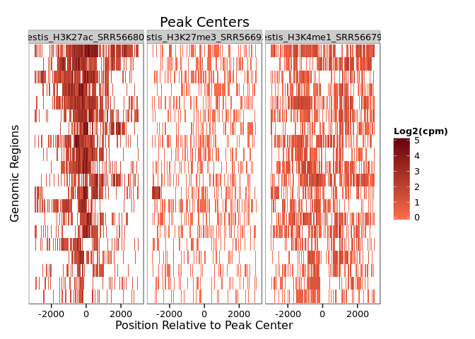
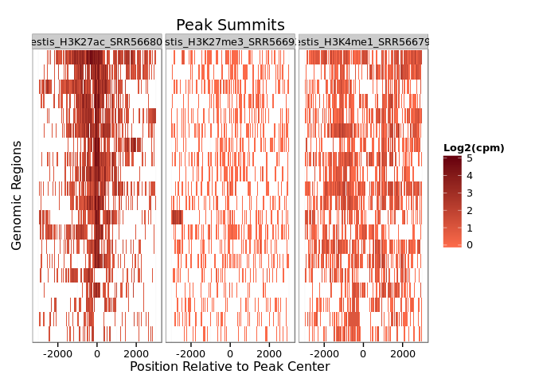

# Tornado Plots in R
Micah D Gearhart  
`r format(Sys.time(), '%d %B %Y')`  

Make sure you have these libraries installed.


```r
library("Rsamtools")
library("rtracklayer")
library("RColorBrewer")
library("dplyr")
library("ggplot2")
```

Define where the datafiles of interest are with an S4 variable


```r
setClass("fileset", representation( filename="character",count="numeric"))

#Define Mouse Chip Datasets
encode<-new("fileset", filename=c(
"~/data/Testis_H3K27ac_SRR566803.bam",
"~/data/Testis_H3K27me3_SRR566931.bam",
"~/data/Testis_H3K4me1_SRR566798.bam"
))

#make sure your Bam Files are Indexed
indexBam("~/Testis_H3K27ac_SRR566803.bam")
indexBam("~/Testis_H3K27me3_SRR566931.bam")
indexBam("~/Testis_H3K4me1_SRR566798.bam")

#this will count the number of reads in each file which we will eventually use for normalization
for (i in 1:length(encode@filename)) {
  encode@count[i]<-countBam(encode@filename[i],param=ScanBamParam(flag = 
  scanBamFlag(isUnmappedQuery = FALSE),))$records
  }

save(encode,file="encode.rdata")
```

Define some functions

```r
#this was from vince buffalo's book
swl<-function (x) {
  sapply(strsplit(sub("(chr[\\d+MYX]+):(\\d+)-(\\d+)", "\\1;;\\2;;\\3",x, perl=TRUE),";;"),"[[",2)
  }

# can set this to any palette in display.brewer.all(9)
reds <- colorRampPalette(brewer.pal(n = 9, "Reds"))

p_param <- PileupParam(distinguish_nucleotides=FALSE,
                       distinguish_strands=FALSE,
                       min_nucleotide_depth=0)


tornado <- function(gr,dataset,pad=250,ord=1) { 

#if gr is not uniform width, find the center of the gr and set width to 1
  if (length(gr) > 1 & var(width(gr))!=0) {
  gr<-GRanges(seqnames = seqnames(gr),
      IRanges(start=start(gr)+ifelse(width(gr)%%2==0,width(gr)/2,
              (width(gr)+1)/2),width=1))
}

#this tells Rsamtools what and where we need data out of the file
sb_param = ScanBamParam(what = c("pos", "rname", "strand","qwidth"), which = gr+pad,
                     flag = scanBamFlag(isUnmappedQuery = FALSE))

#scan the bam files 

files <- gsub("\\.bam","",sapply(strsplit(dataset@filename,"\\/"), function (x) x[length(x)]))

resL<-list()

for (i in files) {
  resL[[i]]<-pileup(dataset@filename[which(files==i)], 
                   scanBamParam=sb_param, pileupParam=p_param)
 #this normalizes to read depth
  resL[[i]]$count<-ceiling(resL[[i]]$count*10e6/dataset@count[which(files==i)])
}

#figure out order for which label
which_factor_levels <-resL %>% 
  bind_rows(.id="genotype") %>% 
  group_by(which_label,genotype) %>% 
  summarize(s = sum(count)) %>% 
  dplyr::filter(genotype==files[ord]) %>% 
  ungroup() %>% 
  mutate(which_label = as.character(which_label)) %>% 
  arrange(s) %>% 
  select(which_label)

which_factor_levels<-as.data.frame(which_factor_levels)[,1]


suppressWarnings(resL %>% 
  bind_rows(.id="genotype") %>% 
  mutate(genotype=factor(genotype)) %>% 
  mutate(startpos=pos-as.numeric(swl(which_label))-pad) %>%
  mutate(count=log2(count)) %>% 
  mutate(which_label = factor(which_label,levels=which_factor_levels)) %>% 
  ggplot(aes(x=startpos,y=which_label,fill=count)) +
  geom_tile() +
  scale_fill_gradient2(low = reds(256)[1],
                       mid = reds(256)[128],
                       high = reds(256)[256],
                       midpoint = 0,
                       name = "Log2(cpm)") + 
  ylab("Genomic Regions") + xlab("Position Relative to Peak Center") +
  facet_grid(. ~ genotype,scales="free_y") + 
  theme_bw() + theme(axis.text.y=element_blank(),
                     axis.ticks.y=element_blank(),
                     panel.grid.major=element_blank())
)
}  
```

Use Encode histone data to make tornado plot

```r
#Read in our saved fileset
load("encode.rdata")

#import the
k27ac_noCrepeaks<-read.table("~/data/k27ac_noCre_peaks.narrowPeak",
                             stringsAsFactors = FALSE)
k27ac_noCre<-GRanges(seqnames=k27ac_noCrepeaks$V1,
                    ranges = IRanges(start=k27ac_noCrepeaks$V2,
                    end=k27ac_noCrepeaks$V3),strand="*",
                    score=k27ac_noCrepeaks$V5,
                    e=k27ac_noCrepeaks$V7,summit=k27ac_noCrepeaks$V10)

#Subset to large peaks for demo
k27ac_noCre<-k27ac_noCre[k27ac_noCre$score > 2000]
length(k27ac_noCre)
```

```
## [1] 98
```

```r
k27ac_noCre_summits<-GRanges(seqnames=seqnames(k27ac_noCre),
                             IRanges(start=start(k27ac_noCre)+k27ac_noCre$summit,
                                     width=1))
```

Now that we are all set up we can start using the function and look at any regions of the genome that we are intereted in.   If you a peaklist directy from MACS the tornado function will align the centers of the peaks like this:

```r
tornado(k27ac_noCre[1:20],dataset=encode,pad=3000) + ggtitle("Peak Centers")
```

 

Be aware however that the center of the peak is often not the peak summit.  This plot uses the summit information that is in the MACS narrowpeak output format.

```r
tornado(k27ac_noCre_summits[1:20],dataset=encode,pad=3000) + ggtitle("Peak Summits")
```

 


